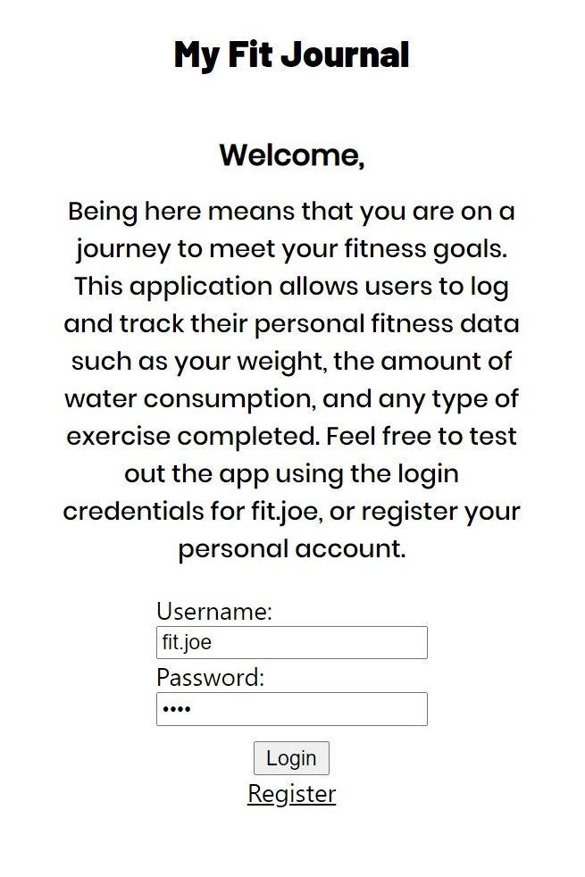
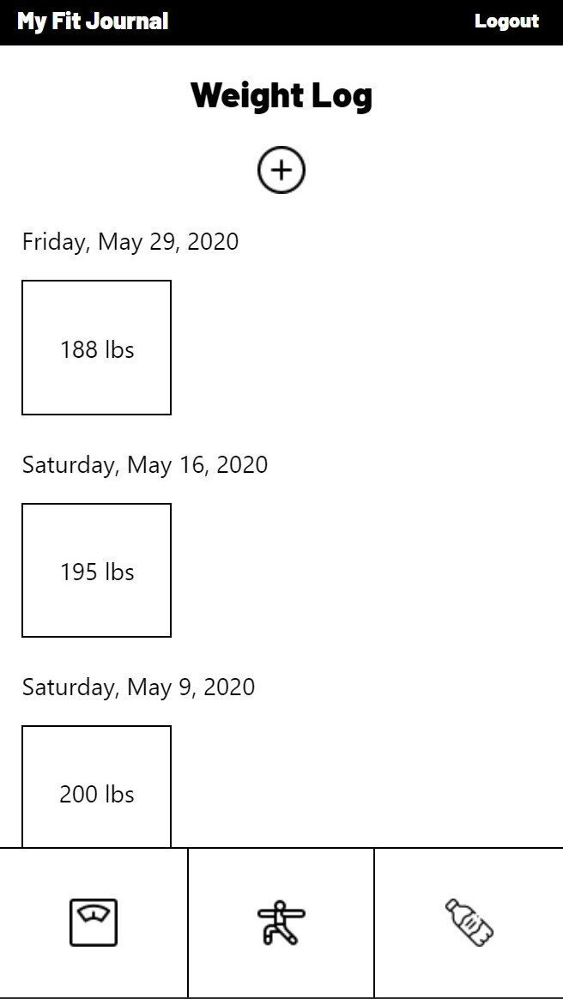
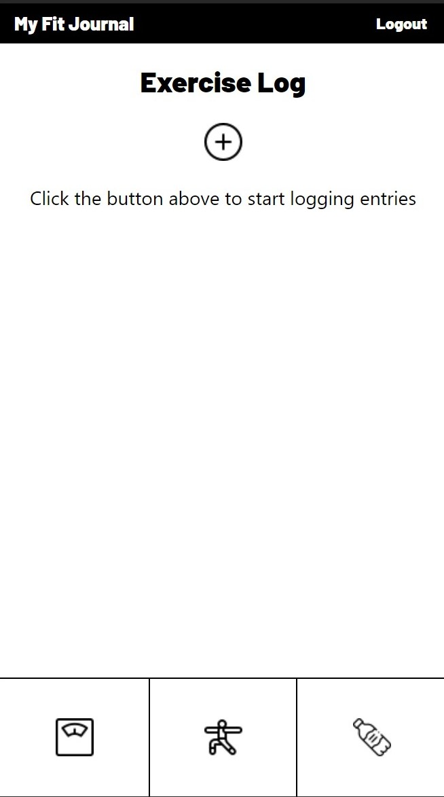
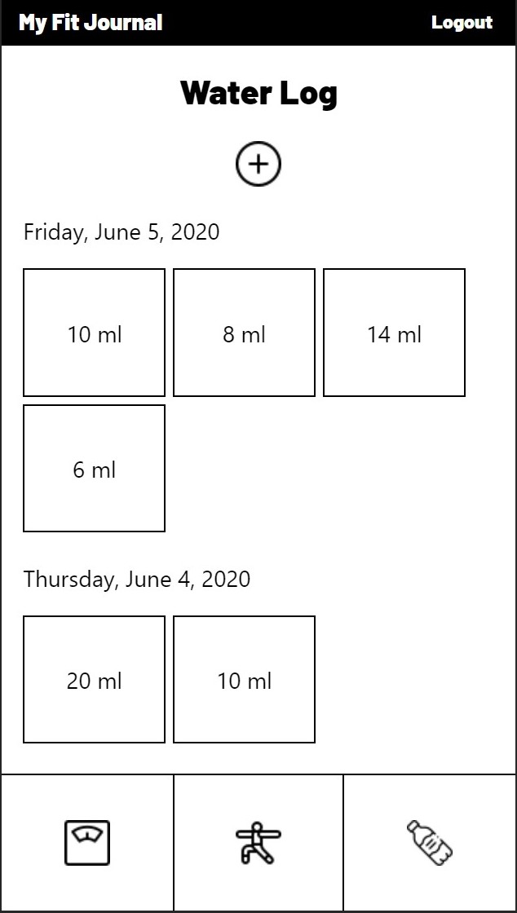

# My Fit Journal Client
### Client side repository for the My Fit Journal Application

Server Repository: https://github.com/cfloyd252/my-fit-journal-api

Live App: https://my-fit-journal.now.sh/

#### Demo Login   
Username: fit.joe     
Password: pass

## Summary
My Fit Journal is a web application that allows the the user to track their fitness progress by logging entries of different types of 
fitness data. Currently there are logs for water consumtion, user's weight, and their exercises. In future updates, the user will also 
be able to log meals and create a list of custom exercise names.

    
    
    
    
    

## Tech Stack

React.js  
Context     
Node.js  
Express  
PostgreSQL  
Mocha/Chai  
Jest  
Heroku  
Vercel 

## Credits
Icons made by <a href="https://www.flaticon.com/authors/freepik" title="Freepik">Freepik</a> from <a href="https://www.flaticon.com/" title="Flaticon"> www.flaticon.com</a>
